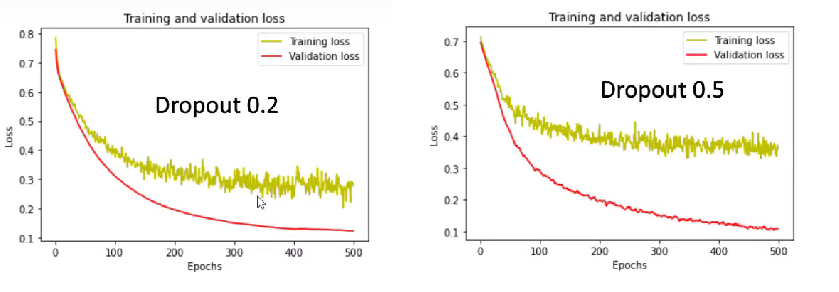
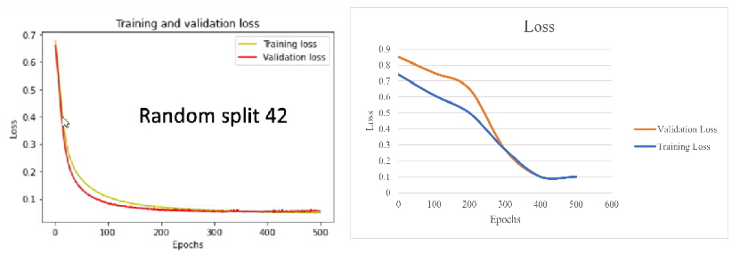
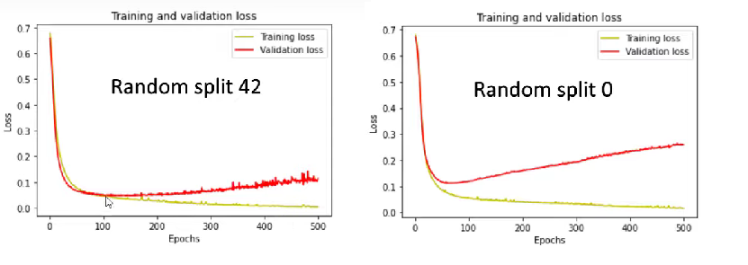
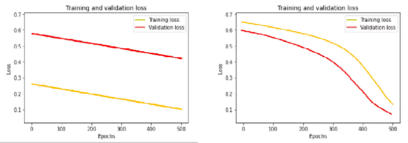
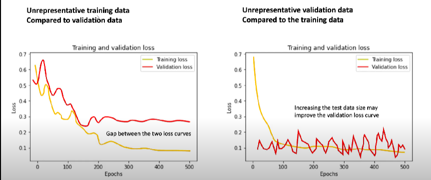

# Loss curves explanation

We can find a multiple types of loss curves, and each one has some specific details that can be related to some patterns.

In the next images we're going to see some examples and its possible explanation.

Some links:

- [Your validation loss is lower than your training loss? This is why!](https://towardsdatascience.com/what-your-validation-loss-is-lower-than-your-training-loss-this-is-why-5e92e0b1747e)
- [Understanding the training and validation loss curves](https://www.youtube.com/watch?v=p3CcfIjycBA&t=1305s)
- [How to Diagnose Overfitting and Underfitting of LSTM Models](https://machinelearningmastery.com/diagnose-overfitting-underfitting-lstm-models/)
---

- Here we can see that our validation loss is **lower**  than training loss.
- It usually indicates that the training data is harder to model than the validation data, and **the model may not be good enough.**
- It's possible to think about an improperly splitting of the data. The randomness in the splitting can avoid to show some data in our training phase and it can hide details to the model.
- Different splittings can return different results on the training, because the model is seeing different examples each time.

- Here we can see a simple model, because the validation loss is lower than the training loss
- Here with the dropout during the training, a percentage of features are set to zero. During the testing all neurons are used. So the model during the training is more robust, and can lead to higher testing acurracies.
- In other words, for training it makes it harder than in testing.
- The value for dropout 0.2 or 0.5 means that during the training phase 20% or 50% percentage of neurons are going to be disabled, So during the testing is more robust.
- The dropout is used in regularization.

- Those are examples of excellent models.
- They are correlated with some differences but at the end they back togheter.

- Overfitting example
- Here our training is doing excellent but the validation is diverging.
- You can consider to add early stopping to keep our model in 100 epochs which has a good performance.
- Here the model is more complex and it can generalize well in the traning data but it comes to fail with validation data.

- Underfitting examples. Validation and traning errors are very high.
- The model cannot learn from the training data.
- We need more training data or our training data is too complicated to our model. So increase the depth or the breath by adding layers or neurons.
- In the second maybe it can learn but it needs more epochs.

- In the first consider shuffle and try again. Try a different splitting. Consider collect more data.
- In the second maybe you have a small validation set. Or is possible that you have a set that isn't representative of the traning data.